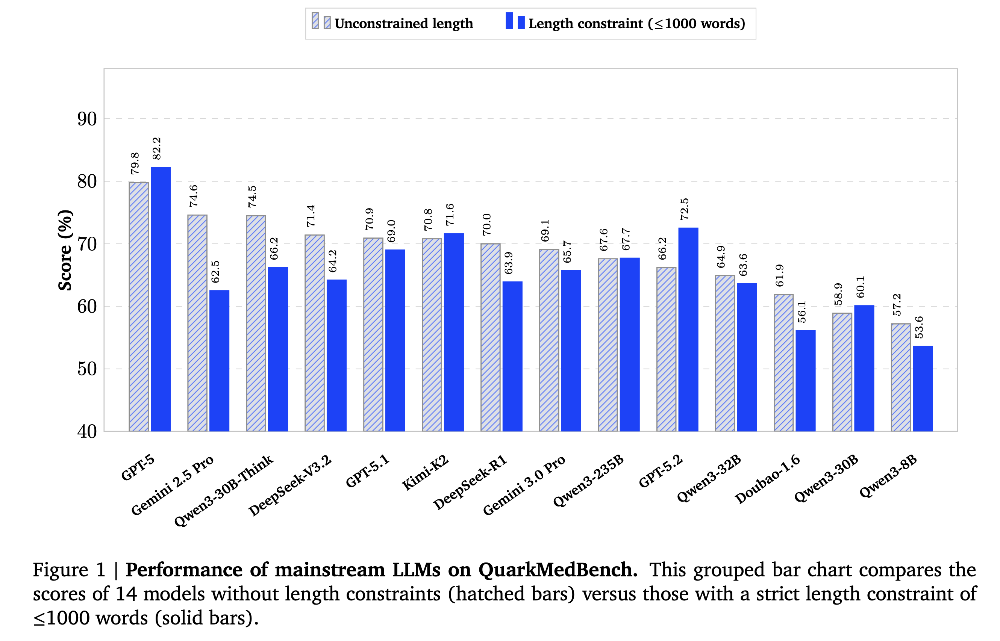

<div align="center">

# 🩺 QuarkMedBench: A Real-World Scenario Driven Benchmark for Evaluating Large Language Models

**Bridging the Chasm Between Standardized Exams and Real-World Clinical Efficacy**

[](https://opensource.org/licenses/MIT)
[](YOUR_LINK_HERE)
[](YOUR_LINK_HERE)

</div>

---

## 🌟 Introduction

Despite the remarkable performance of Large Language Models (LLMs) on standardized medical examinations (such as the USMLE and CNMLE), conquering multiple-choice benchmarks does not linearly translate to clinical efficacy. Current evaluations predominantly rely on structured factual retrieval, failing to capture the unstructured, ambiguous, and long-tail complexities inherent in genuine user inquiries. Consequently, the absence of ecologically valid benchmarks precludes the objective measurement of model safety and utility in actual healthcare deployment.

**QuarkMedBench** is introduced to bridge this paradigm chasm. Moving beyond static medical knowledge assessment, it provides a comprehensive, multi-dimensional framework tailored for evaluating LLMs in real-world medical question-answering scenarios.

---

## 🏆 Leaderboard: Mainstream LLMs Performance

QuarkMedBench reveals the true clinical adaptability and "length bias" vulnerabilities of frontier LLMs. The chart below illustrates the performance divergence of 14 mainstream models when subjected to rigorous medical scrutiny, both with and without generation length constraints.

<div align="center">
  <!-- 请确保将下面的链接替换为您仓库中图片的实际相对路径 -->
  
  <br/>
  <em><b>Figure 1: Performance of mainstream LLMs on QuarkMedBench.</b> The grouped bar chart compares the scores without length constraints (hatched bars) versus those subjected to a strict $\le$1000-word constraint (solid blue bars).</em>
</div>

**Key Insights:**

* **Length Bias Exposed:** Models like Gemini 2.5 Pro and GPT-5 exhibit significant score drops when strictly constrained ($\le$1000 words), revealing a reliance on text inflation rather than information density.
* **Reasoning Yields Safety:** Models equipped with Chain-of-Thought (e.g., Qwen3-30B-Think) maintain robust scores and drastically lower clinical penalty rates, underscoring the necessity of "slow thinking" in medical safety.

---

## 🚀 Core Contributions & Methodology

### 1. Massive Real-World Dataset 📊

Instead of relying on textbook excerpts, we employed a multi-axis stratified sampling strategy based on authentic Internet healthcare logs. The dataset encompasses a massive scale of high-quality evaluation data:

* **20,821** Authentic User Queries (rigorously cleaned and desensitized).
* **203,945** Fine-grained Evaluation Rubrics generated.
* **~9.8** Highly structured Rubrics tailored for *each* individual query.

To capture the true ecological distribution of online medical interactions, the dataset is configured with **70% single-turn QA** (testing precise knowledge extraction) and **30% multi-turn dialogues** (testing contextual memory and intent refinement). The scenarios exhibit a pronounced long-tail characteristic across three core domains:

- 🏥 **Clinical Care (66.22%):** The primary evaluation body assessing evidence-based recommendations. Dominated by high-frequency Internet consultations, including *Digestive System (19.4%)*, *Reproductive System (16.4%)*, and *Integumentary System (11.8%)*.
- 🍏 **Wellness Health (27.61%):** Covering preventative care and lifestyle interventions. Key sub-domains include *Nutrition & Diet (21.50%)*, *Medical Aesthetics (9.68%)*, *Fitness (5.99%)*, and *Medical Policies*.
- 🔬 **Professional Inquiry (6.08%):** Evaluating reasoning capabilities in complex logic and academic literature, focusing on *Clinical Medicine (31.1%)*, *Basic Medicine Science (30.3%)*, and *Medical Technology (8.5%)*.

### 2. Automated, Multi-Model Rubric Generation 🤖

To overcome the quantitative difficulties and prohibitive costs of manual evaluation in open-ended QA, we propose a highly efficient Auto-Rubric generation pipeline. 

- Integrates multi-model consensus (e.g., GPT-5, Qwen-Max, DeepSeek-R1) with external Evidence-Based Retrieval (DeepResearch).
- Dynamically generates fine-grained, query-sensitive rubrics.
- Achieved a **91.8% concordance rate** with human expert adjudications through rigorous blind audits.

### 3. Hierarchical Constraints & Circuit-Breaker Penalties ⚖️

QuarkMedBench abandons simplistic scoring, introducing a structured quantification mechanism to systematically combat "length bias" and penalize high-risk clinical outputs:

- **Positive Dimensions:** Essential (Core facts/diagnoses), Important (Clinical reasoning), and Highlight (Extended value/evidence).
- **Negative Dimension (Pitfall):** A strict circuit-breaker penalty mechanism that decisively punishes factual deviations, unsafe medical advice, or failures to recognize multi-objective contraindications.

---

## 💡 Why QuarkMedBench?

* **Ecological Validity:** Precisely aligns with genuine, long-tail online user intents and local clinical guidelines.
* **Immune to Benchmark Decay:** The automated generation framework inherently supports the timely, dynamic updating of medical knowledge, circumventing the obsolescence typical of traditional static benchmarks.
* **Rubrics as Rewards:** The fine-grained rubrics generated can be seamlessly integrated into RLHF/GRPO training pipelines to drive value-aligned medical LLM optimization.
* **Domain Agnostic Potential:** The underlying methodology possesses substantial generalization potential for extension into other high-fault-intolerance vertical domains (e.g., Law, Finance).

---

## 📖 Citation

If you find our dataset or methodology helpful, please consider citing our paper:

```bibtex
@article{quarkmedbench2026,
  title={QuarkMedBench: A Fine-Grained Evaluation Benchmark for Large Language Models in Real-World Medical Scenarios},
  author={Your Name and Co-authors},
  journal={arXiv preprint arXiv:XXXX.XXXXX},
  year={2026}
}
